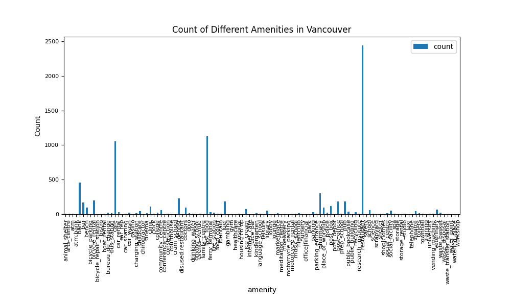

  
<br/><br/><br/><br/>

## Table of Contents :triangular_flag_on_post:

- Problem Statement
- Data Used
- Exploratory Data Analysis
- Techniques Used
- Results and Findings
- Limitations

## Problem Statement

As Vancouver locals, we can fail to recognize how unique and special the city is. Vancouver is home to many vibrant and interesting areas that consist of various tourist attractions, amenities and more. As part of our project, we collected GPX data from across the Lower Mainland to give a tour of various Vancouver must-see landmarks, restaurants, and more. By running this program, people who are in and around the Lower Mainland can make informed decisions on the things they want to see and go to with this data.

## Data Used

## Exploratory Data Analysis

We will first obtain visualizations on the data set prior to obtaining any additional information. The table below displays the datatypes of each column seen in the data frame, after a count of total amenities has been obtained.

| Column Name | Data Type           |
| ----------- | ------------------- |
| `lat`       | double              |
| `lon`       | double              |
| `timestamp` | timestamp           |
| `amenity`   | string              |
| `name`      | string              |
| `tags`      | map<string, string> |
| `count`     | bigint              |

From there, we can determine the frequency of specific amenities with the Lower Mainland. The amenities seen the most frequent are seen at the first. (i.e., restaurant, fast food etc). These unique items are placed in a bar graph for a visual analysis:

```json
"restaurant":2444,
"fast_food":1131,
"cafe":1055,
"bank":458,
"pharmacy":306,
"dentist":226,
"bicycle_rental":201,
"fuel":188,
"post_office":187,
"pub":186,
"bar":173,
"post_box":116,
"clinic":114,
"doctors":99,
"place_of_worship":96,
"bench":95,
"ice_cream":71,
"veterinary":68,
"school":62,
"community_centre":58,
"library":50,
"social_facility":49,
"childcare":43,
"theatre":41,
"public_bookcase":38,
"car_rental":33,
"recycling":31,
"parking":29,
"ferry_terminal":28,
"college":23,
"waste_basket":21,
"bureau_de_change":20,
"car_wash":20,
"police":20,
"fire_station":19,
"charging_station":18,
"toilets":18,
"marketplace":17,
"bus_station":16,
"kindergarten":16,
"dojo":13,
"cinema":12,
"nightclub":12,
"social_centre":12,
"arts_centre":11,
"research_institute":11,
"shelter":11,
"vending_machine":11,
"music_school":10,
"car_sharing":9,
"drinking_water":9,
"events_venue":9,
"atm":8,
"boat_rental":8,
"hospital":8,
"fountain":7,
"townhall":7,
"food_court":6,
"science":6,
"studio":6,
"university":6,
"language_school":5,
"parking_entrance":5,
"prep_school":5,
"spa":5,
"animal_shelter":4,
"clock":4,
"construction":4,
"bicycle_parking":3,
"driving_school":3,
"lounge":3,
"motorcycle_parking":3,
"workshop":3,
"bicycle_repair_station":2,
"conference_centre":2,
"courthouse":2,
"cram_school":2,
"internet_cafe":2,
"post_depot":2,
"scrapyard":2,
"atm;bank":1,
"bistro":1,
"car_rep":1,
"casino":1,
"chiropractor":1,
"disused:restaurant":1,
"family_centre":1,
"gambling":1,
"gym":1,
"healthcare":1,
"housing co-op":1,
"juice_bar":1,
"leisure":1,
"lobby":1,
"meditation_centre":1,
"monastery":1,
"motorcycle_rental":1,
"nursery":1,
"office|financial":1,
"park":1,
"public_building":1,
"safety":1,
"shop|clothes":1,
"storage":1,
"storage_rental":1,
"taxi":1,
"telephone":1,
"training":1,
"waste_disposal":1,
"waste_transfer_station":1,
"water_point":1,
"watering_place":1
```



There are far too many items to analyze as part of our tour - who wants to see a bench when they visit Vancouver? In order to further analyze the data, only items which are tagged under tourism are considered.

